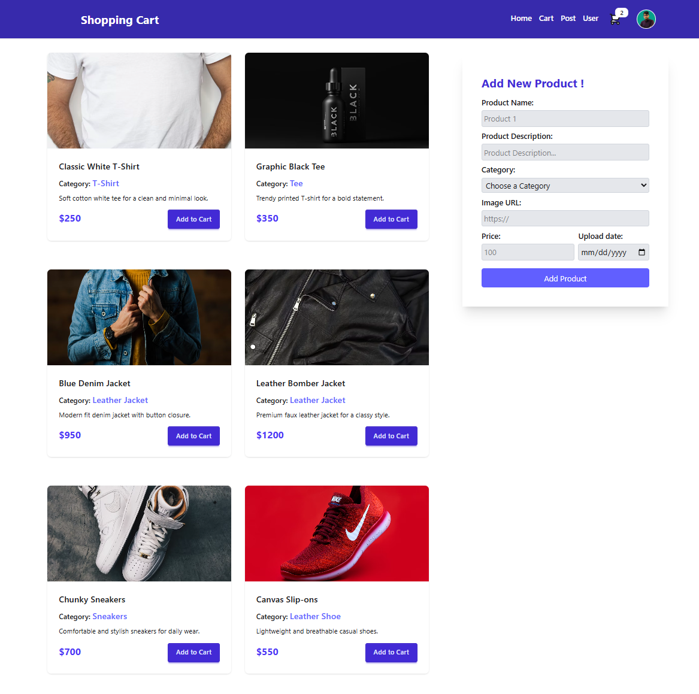
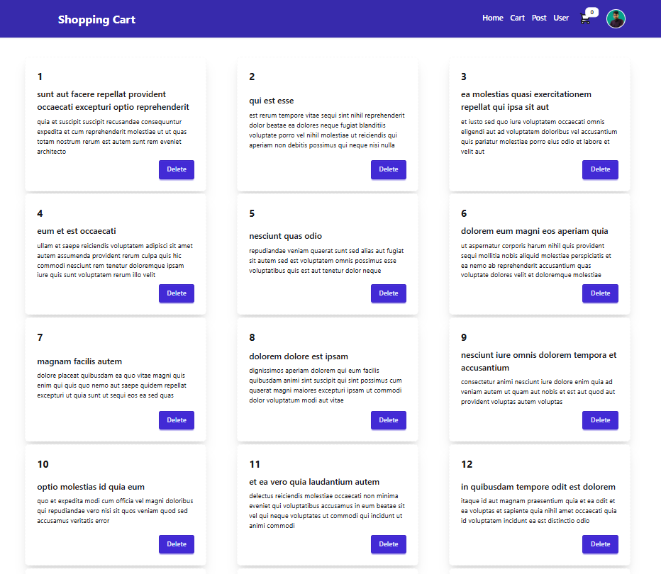
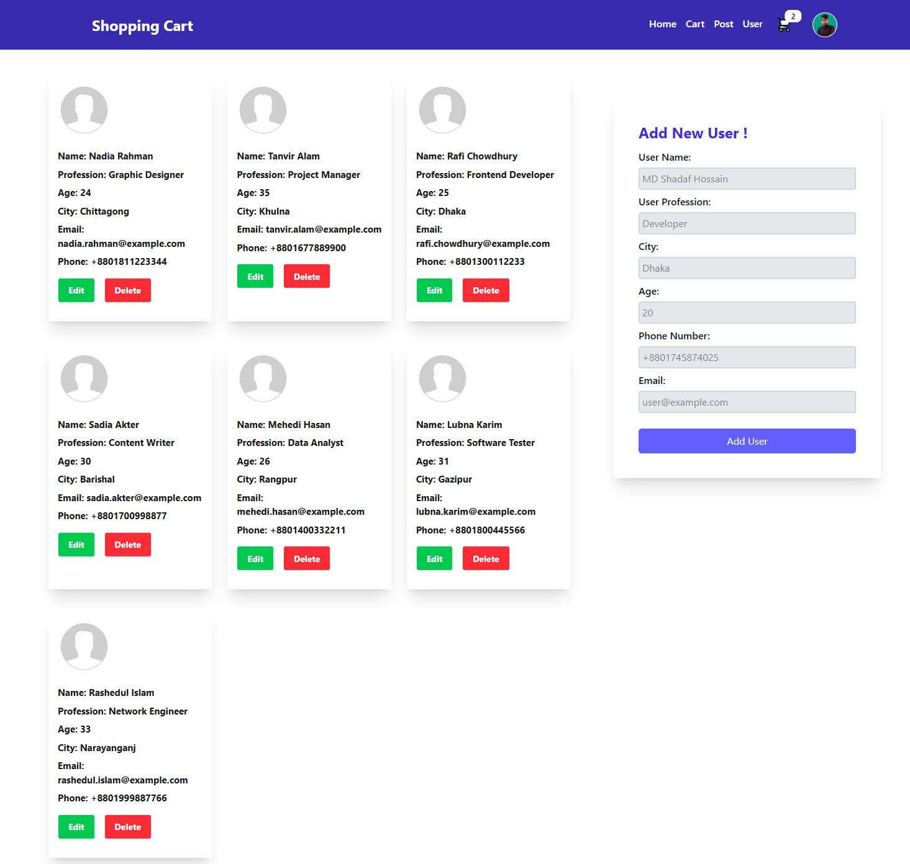
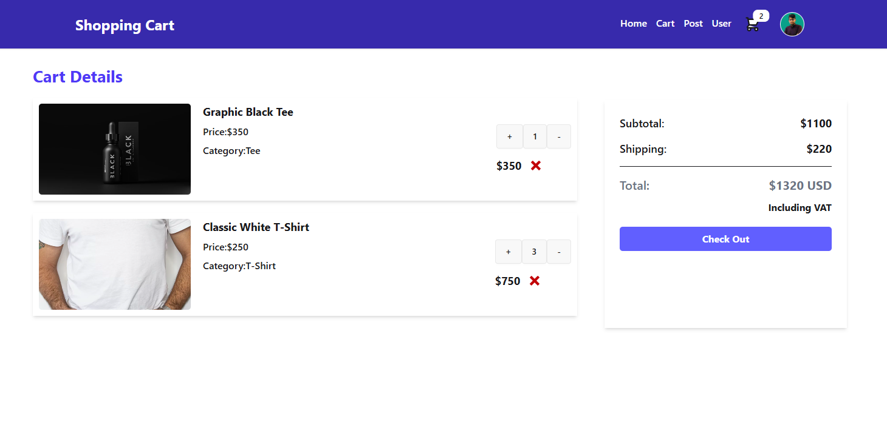

# 🛒 Shopping Cart — React RTK CRUD + Cart App

### 🧾 About This Project

A modern **React + Redux Toolkit** web app featuring **CRUD operations, a dynamic shopping cart**, and smooth **state management with RTK Query**.
Built for learning and practice with **mock APIs (JSON Server + JSONPlaceholder)** and styled using **Tailwind CSS + DaisyUI** for a clean, responsive UI.


---

## 🔗 GitHub Repository

👉 [https://github.com/shadafhossain01/Shopping-Cart.git](https://github.com/shadafhossain01/Shopping-Cart.git)

## 🔗 Live Link

👉 [https://shopping-cart-xi-sepia.vercel.app](https://shopping-cart-xi-sepia.vercel.app)

---

# 🚀 Tech Stack

| Category               | Technology Used                      |
| ---------------------- | ------------------------------------ |
| **Frontend**           | React, React Router DOM              |
| **State Management**   | Redux Toolkit, RTK Query             |
| **Styling**            | Tailwind CSS, DaisyUI                |
| **Mock Backend**       | JSON Server (port: 3000), JSON files |
| **API Source**         | JSONPlaceholder (for posts)          |
| **Development Server** | Vite                                 |


# 📂 Project Structure & Features

## 📰 **Post Page**

* Fetches post data from **JSONPlaceholder API** using **RTK Query**.
* Displays posts in a responsive grid layout.
* Each post card includes a **Delete** button.
* Demonstrates **API fetching, caching, and invalidation** with RTK Query.



## 👤 **User Page**

* Full **CRUD operations** handled via **JSON Server (port 3000)**.
* Add, edit, and delete users with a modern input form.
* Uses **RTK Query’s `providesTags`** and **`invalidatesTags`** for real-time UI updates.
* Displays detailed user cards with **Name, Profession, City, Age, Email, and Phone**.
* Includes validation and instant feedback after actions.



## 🧥 **Product Page**

* Loads product data from a **local JSON file**.
* Each product card shows image, category, and price.
* Functional **Add to Cart** button — updates cart in Redux state.
* Demonstrates **local data rendering** and **component reusability**.


## 🛍️ **Cart Page**

* Displays products added to the cart using **Redux Toolkit state**.
* Allows removing items dynamically.
* Real-time UI updates and clean user experience.


---

# 🧩 Key Functionalities

* ✅ Full **CRUD operations** using RTK Query + JSON Server
* ✅ **Cart management** using Redux Toolkit state
* ✅ **Dynamic form handling** (User & Product)
* ✅ **Real-time UI updates** via RTK Query tags
* ✅ **Responsive and modern UI** with Tailwind CSS + DaisyUI
* ✅ **Reusable and modular React components**


# ⚙️ How to Run Locally

```bash
# 1️⃣ Clone the repository
git clone https://github.com/shadafhossain01/Shopping-Cart.git
cd Shopping-Cart

# 2️⃣ Install dependencies
npm install

# 3️⃣ Run JSON Server (for User data)
npx json-server --watch db.json --port 3000

# 4️⃣ Start the React app
npm run dev
```

Then open the app in your browser:
👉 **[http://localhost:5173](http://localhost:5173)**


---


# 📊 Features Summary

| Page             | Features                                 | Data Source             |
| ---------------- | ---------------------------------------- | ----------------------- |
| **Post Page**    | Read & Delete (API Fetch with RTK Query) | JSONPlaceholder         |
| **User Page**    | Full CRUD + Auto UI Refresh              | JSON Server (port 3000) |
| **Product Page** | Local JSON Data + Add to Cart            | Local JSON File         |
| **Cart Page**    | View & Remove Cart Items                 | Redux State             |

